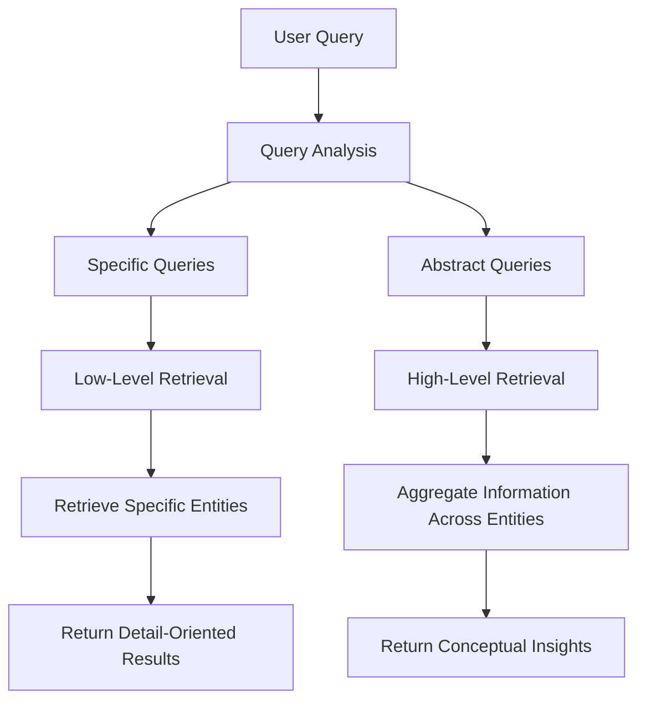
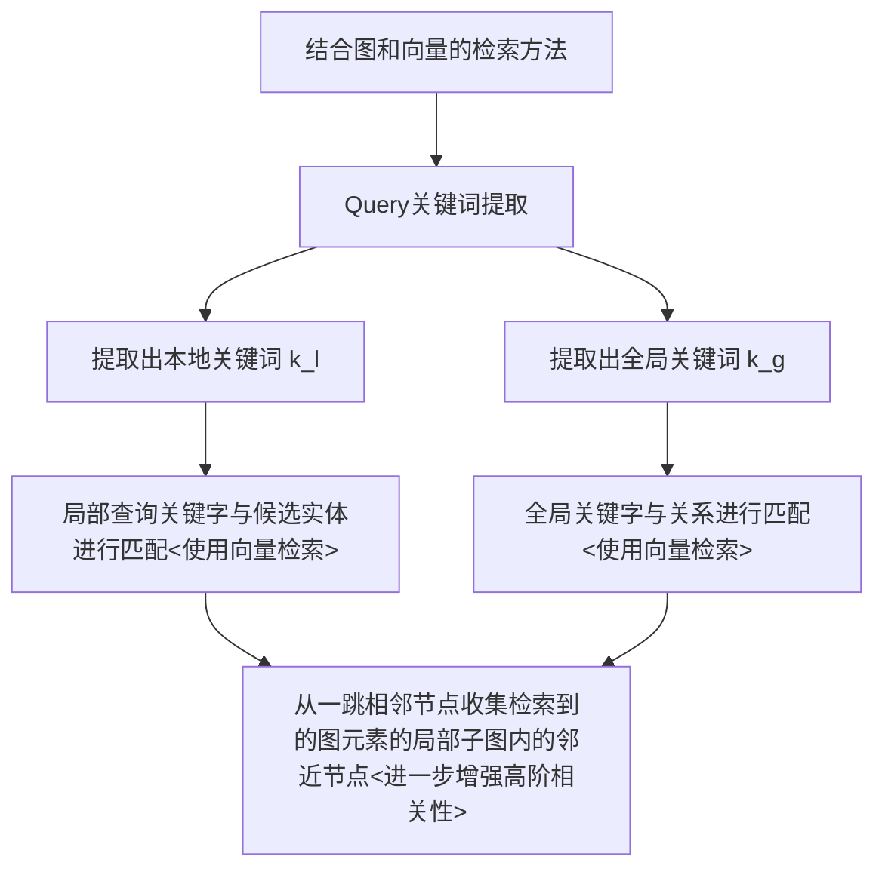

+++
title = "[读论文] LightRAG"
date = "2024-12-17"
description = "一种效果与GraphRAG相当，且更好用更便宜的RAG"
tags = [
 "LLM",

 "RAG"

]
categories = [
 "大模型技术",
]
image = "https://typora-picturelib.oss-cn-beijing.aliyuncs.com/image-20241218104735239.png"

+++

> “优点是便宜且易于增删改查，缺点是搜索深度变差，广度不一定有所提高。性能是否能如实验结果所说能打赢GraphRAG有待考察”

*原文地址：[LIGHTRAG: SIMPLE AND FAST RETRIEVAL-AUGMENTED GENERATION](https://arxiv.org/pdf/2410.05779)*

## Highlight

- **图结构文本索引**：LLM-based，用来捕捉实体间的关系、优化向量检索

- **双层次检索模式**
  - 低层次检索：处理特定查询键，精准检索

  - 高层次检索：处理抽象查询键，检索概念性总体主题

- **增量更新算法**：用来实时适应新数据

## Overall framework

$$
\mathcal{M} = \left( \mathcal{G}, \mathcal{R} = (\varphi, \psi) \right), \quad 
\mathcal{M}(q; \mathcal{D}) = \mathcal{G} \left( q, \psi(q; \widehat{\mathcal{D}}) \right), \quad 
\widehat{\mathcal{D}} = \varphi(\mathcal{D})
$$
- $\mathcal{M}$：整体框架

- $\mathcal{D}$：外部数据库

- $\widehat{\mathcal{D}}$：索引数据结构（知识图谱）

- $\mathcal{q}$：输入查询

- $\mathcal{G}$：生成模块

- $\mathcal{R}$：检索模块

- $\varphi()$：数据索引器

## GRAPH-BASED TEXT INDEXING 文本索引构建方法

$$
\widehat{D} = (\widehat{V}, \widehat{E}) = \text{Dedupe} \circ \text{Prof}(V, E), \quad  V, E = \bigcup_{D_i \in D} \text{Recog}(D_i)
$$

- $\mathcal{D}$：输入的原始文本
- $\mathcal{D}_i$：原始文本被分成的每个块（用来提高文本处理效率）
- $\mathcal{V}$：从所有文档中提取的实体（节点）集合。
- $\mathcal{E}$：从所有文档中提取的关系（边）集合
- $\hat{\mathcal{V}}$：去重后的实体集合
- $\widehat{E}$：去重后的关系集合
- $\hat{\mathcal{D}}$：最终生成的知识图结构
- $\text{Recog}(\mathcal{D}_i)$：从 $\mathcal{D}_i$ 提取实体和关系
- $\bigcup_{\mathcal{D}_i \in \mathcal{D}}$：将所有文本块 $\mathcal{D}_i$ 的提取结果合并
- $\text{Prof}(\mathcal{V}, \mathcal{E})$：*用于键值对生成的LLM分析* *****
- $\text{Dedupe}(\mathcal{V}_{\text{prof}}, \mathcal{E}_{\text{prof}})$：对 $\mathcal{V}_{\text{prof}}$ 和 $\mathcal{E}_{\text{prof}}$ 去重

**索引增强模块**$\text{Prof}(\mathcal{V}, \mathcal{E})$：

LLM驱动，为每个节点和边生成一个索引键值对

- 索引键：一个单词或短短语
  - 实体使用它们的名称作为唯一的索引键
  - 关系可能有多个索引键，这些索引键来自 LLM 的增强（包括来着连接的实体的全局主题）

- 值：基于 LLM 的文本总结，为检索到的内容提供上下文信息

### 效果

- 通过去重最小化图的大小

- 键值对数据结构增强了向量检索时的效率

- **快速适应增量数据**，引入图结构的同时保留知识库增删改查功能。

  > 对于新文档D′，增量更新算法使用与之前相同的基于图的索引步骤$\varphi$对其进行处理，从而得到D′ = (ˆV′, ˆE′)。随后，通过取节点集V 和 ˆV′的并集，以及边集E 和 ˆE′的并集，将新的图数据与原始图数据结合起来。

## DUAL-LEVEL RETRIEVAL PARADIGM 检索方法

具体检索方式：

## RETRIEVAL-AUGMENTED ANSWER GENERATION 内容生成

将分析函数P(·)生成的值（包括名称，实体和关系的描述，以及原始文本的摘录）作为提示集成到 LLM 输入中

## 成果

**生成效果**

效果优于所有未使用图的方法。在特定领域数据集上优于GraphRAG

> *“图谱结构扁平，还只取一跳相邻节点的数据，为什么能超过GraphRAG？”*

**成本分析**

token消耗量远低于GraphRAG

结合上述公式与每个 chunk 1200 token的信息可以估计为**四个数据集（1000万token）**构建知识图谱，总共消耗约 **2000万 tokens**

---

*GitHub：[HKUDS/LightRAG: "LightRAG: Simple and Fast Retrieval-Augmented Generation"](https://github.com/HKUDS/LightRAG)*

**算法实现**

